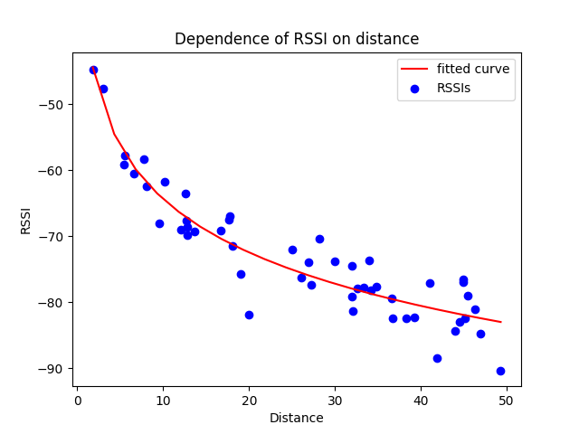
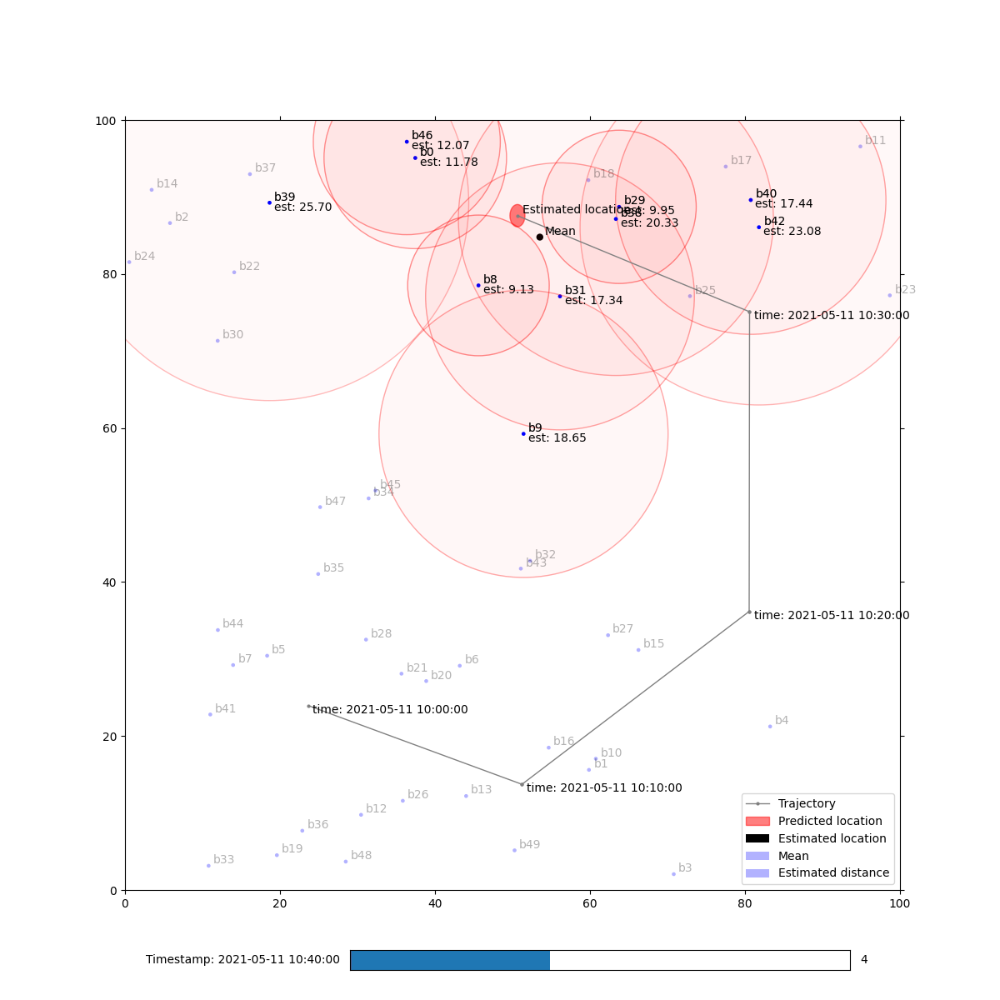

# HsH MIN-VC Project 2: Localization and Multilateration
(Find [rendered README.md on GitHub](https://github.com/denglisch/hsh_vc-2).)

Calculate and 2D visualize current locations in space of a device measured RSSI-data.

Localization is done by two approaches:
- Multilateration using the _Log-Distance Path Loss Model__ and _Levenberg-Marquardt Algorithm__ (main part).
- Experimental approach using AI to predict location based on synthetic data.


# Run Project
Clone with `git`:
```
git clone git@github.com:denglisch/hsh_vc-2.git
```

Either run project with `python`:
```
python3 localization_pro_widget.py 
```
Make sure required `minvc.py`, `beacons_proj.csv`, `calibration_proj.csv` and `measurement_proj.p` are in the same folder and the directory `out/` exists.

Or import into [PyCharm](https://www.jetbrains.com/de-de/pycharm/) as stated below.

## How to start with PyCharm
- Choose `hsh_vc-2` in open dialog (File -> Open...),
- Open `requirenmets.txt` and press button "Install all packages",
  - If PyCharm is asking for an environment, use virtual in `.venv`-folder (default).
- Open `localization_pro_widget.py` and hit "Run" button.

# What these files are?
- `minvc.py` contains classes for beacons, measurements and a RSSI-converter.  
	(This file was given by the lecturer and was customized a bit.)
- `beacons_proj.csv` contains 50 beacons names and locations (x-, y- and z-values).  
	(This file was given by the lecturer.)
- `calibration_proj.csv` contains actual distances to corresponding RSSI-values necessary to calculate `c0` and `n`.  
	(This file was given by the lecturer.)
- `measurement_proj.p` contains `Measurements` objects that represent measured data with device name, timestamp and a list of received beacons and RSSI-values.  
	(This file was given by the lecturer.)
- `out/` directory is where the resulting `distances.csv` is stored, which contains device locations at time.
- `localization_pro_widget.py` is "where the magic happens".
	Its `main()` is running the calculation and visualization explained in the [following paragraph](#what-does-it-do).


# What does it do?

1. Loads calibration data (`calibration_proj.csv`):  
	These are RSSI values and corresponding distances we need to calculate parameters `c0` and `n` for _Log-Distance Path Loss Model_.
	We calculated following values:
	- `c0`: -37.45877267729592
	- `n`: 2.689458542605622
2. Visualizes calibration data in scatter plot (image below) and adds a fitted curve according to parameters above.  


3. Loads beacons locations and measured data.
4. Calculates for each measurement the distance to corresponding RSSI according to calibration data.
5. Estimates a location for each measurement using Levenberg-Marquardt algorithm. 
	The seed value is the mean of received beacon locations.
6. Visualizes measured and calculated data in an interactive 2D plot (image below).
	- By using a slider you can scroll through timestamps (the data will be sorted chronologically).
	- Beacons within a measurement will be highlighted. 
		The circle around represents the calculated distance.
		The greater the distance is the higher is the alpha-value of the circles.
	- For timestamps greater than first one, the trajectory of located device will be shown.
	- Estimated location is displayed as an ellipse. 
		This represents the uncertainties of the localization.
		The radiuses of this ellipse are calculated by the standard deviation in x and y for each measurement.
		
		As you will see, the z-value of uncertainty is very high (up to 20 meters).
		This goes back to the beacons locations. 
		All of them have a z-value between 2 and 3 meters.
		
		


7. In last step, stores distances as `csv`-file in `out/distances.csv` as follows:

name|time|x|y|z
---|---|---|---|---
d0|2021-05-11 10:00:00|23.63999568|23.9532634|2.6877206
...|...|...|...|...
 


# Known Issues
There are still some `#TODO`s in the code... But this way you’ll find where to put hands on ;)

Issues: 
- Assumption: Jacobian matrix received from the _Least Squares Method_ is always regular.
	Here we just calculates its inverse. 
	For singular case you should implement singular-value decomposition.
- Assumption in visualization: There is only one measurement for each timestamp.
	If there are colliding timestamps (highly unlikely, but possible with synthetic data), we're not sure, what happens;)
- Trajectory actually affects only for one device.
	If the measured data contains more than one device, this need to be fixed.
- There is no sort out of bad or unrealistic measured data.
	To make it more robust, you could filter measured beacon data for each measurement for each timestamp and use only a subset of beacons RSSIs for calculation.
	Eg. skip outliers, use only best 5, use a RSSI- or distance-threshold, etc.
	
<!--
# PyCharm Shortcuts
Vorher per Addon auf xcode geändert
- Preferences->Plugins->Search xcode->install

Run | shortcut 
 --------| -------- 
Run Debug | cmd+r
Stop debug | cmd+. 2x
--------| --------
Code | shortcut 
 --------| --------
Comment line out | cmd+shift+7(muss geändert werden) 
Quick Doc der Funktion | fn+F1
Show all input parameter | cmd+shift+p
--------| --------
navigate | shortcut 
 --------| --------
Jump in definition | cmd+mouse-click
Jump back | cmd+ctrl+<-
-->