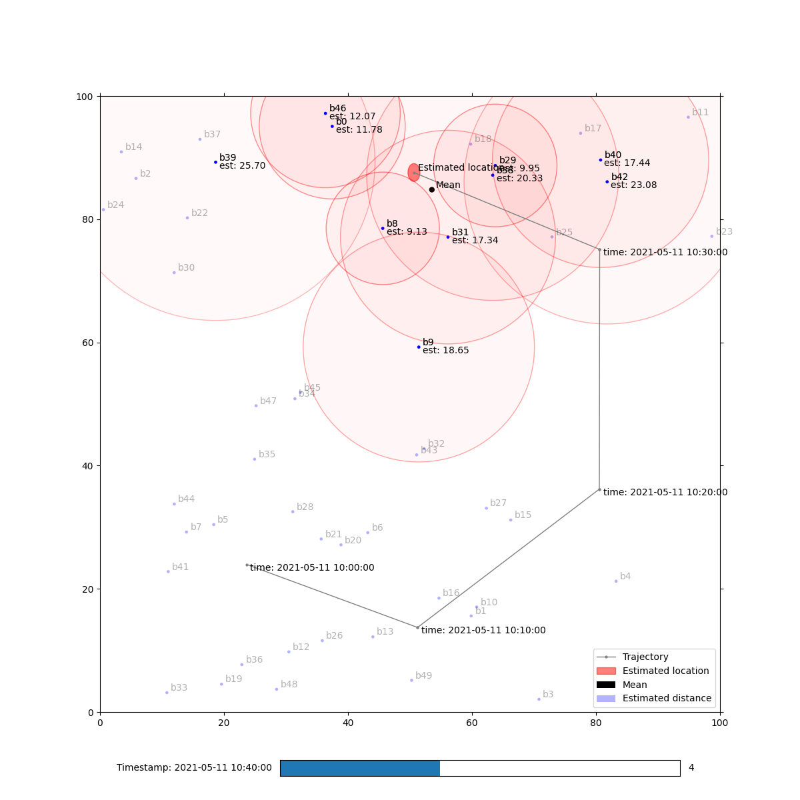

# HsH MIN-VC Project 2: Localization and Multilateration


# Run Project
Clone with `git`:
```
git clone git@github.com:denglisch/hsh_vc-2.git
```

Either run project with `python`:
```
python3 localization_pro_widget.py 
```
Make sure required `minvc.py`, `beacons_proj.csv`, `calibration_proj.csv` and `measurement_proj.p` are in the same folder.

Or import into [PyCharm](https://www.jetbrains.com/de-de/pycharm/).

## How to start with PyCharm
- Choose `hsh_vc-2` in open dialog (File -> Open...),
- Open `requirenmets.txt` and press button "Install all packages",
  - If PyCharm is asking for an environment, use virtual in `.venv`-folder (default).
- Open `localization_pro_widget.py` and hit "Run" button.


# What does it do?
...Gets some data (general info)
...What the files are

1. Loads calibration data (`calibration_proj.csv`):  
	These are RSSI values and corresponding distances we need to calculate parameters `c0` and `n` for _Log-Distance Path Loss Model_.
	We calculated following values:
	- `c0`: -37.45877267729592
	- `n`: 2.689458542605622
2. Visualizes calibration data in scatter plot (image below) and adds a fitted curve according to parameters above.  

3. Loads beacons locations and measured data.
4. Calculates for each measurement the distance to corresponding RSSI according to calibration data.
5. Estimates a location for each measurement using Levenberg-Marquart algorithm. 
	The seed value is the mean of received beacon locations.
6. Visualizes measured and calculated data in an interactive 2D plot (image below).
	- By using a slider you can scroll through timestamps (the data will be sorted chronologically).
	- Beacons within a measurement will be highlighted. 
		The circle around represents the calculated distance.
		The greater the distance is the higher is the alpha-value of the circles.
	- For timestamps greater than first one, the trajectory of located device will be shown.
	- Estimated location is displayed as an ellipse. 
		This represents the uncertainties of the localization.
		The radiuses of this ellipse are calculated by the standard deviation in x and y for each measurement.


7. In last step, stores distances as `csv`-file in `out/distances.csv` as follows:

name|time|x|y|z
---|---|---|---|---
d0|2021-05-11 10:00:00|23.63999568|23.9532634|2.6877206
...|...|...|...|...
 


...Update vis-image
...further files
...STILL some `TODO`s in there... But this way you’ll find where to put hands on ;)
...AI stuff


# PyCharm Shortcuts
Vorher per Addon auf xcode geändert
- Preferences->Plugins->Search xcode->install

Run | shortcut 
 --------| -------- 
Run Debug | cmd+r
Stop debug | cmd+. 2x
--------| --------
Code | shortcut 
 --------| --------
Comment line out | cmd+shift+7(muss geändert werden) 
Quick Doc der Funktion | fn+F1
Show all input parameter | cmd+shift+p
--------| --------
navigate | shortcut 
 --------| --------
Jump in definition | cmd+mouse-click
Jump back | cmd+ctrl+<-


 